# Secure Communication Channel for IoT Devices

## Overview :

In todays  world, with tedious manual tasks getting automated, several parts of india still find people physically going from house to house noting down electricity meter readings to generate bills. The main disadvantage of this task is that, it may lead to human errors and inaccurate readings or bill generations. In some cases, people even have to travel to remote locations for this purpose.\
Our application  aims to solve this problem by automating the bill generation process by fetching the meter readings from each customers associated meter, generating a monthly bill and sending it out to each and every customer, which they can access through a web portal. The main advantage of this application is that the bills generated are accurate, reliable and error-free. The customer can they pay the bill via their preferred method of payment.
The application also contains a feature where the customer can raise a complaint with the system administrator. The user can track the status of his complaint. On resolving the issue, the system administrator marks the status as completed.\
The primary motivation for this application stemmed from an interest in trying to create a secure communication channel for IOT devices to communicate on.

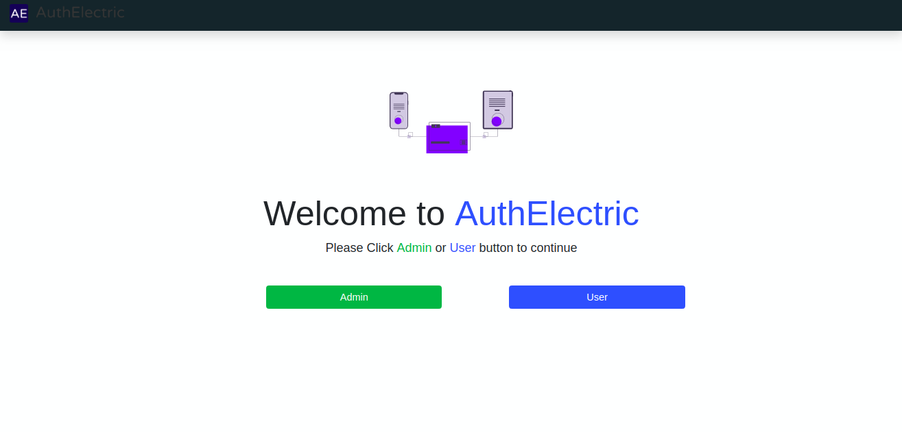

## Requirements : 

<ul>
    <li> Operating System </li>
    <ul>
        <li>Ubuntu 16.04 +</li>
        <li>Windows</li>
    </ul>
    <li> Database </li>
    <ul>
        <li>PostgreSQL</li>
        <li>Redis</li>
    </ul>
    <li> Browser </li>
    <ul>
        <li>Chrome </li>
        <li>Firefox</li>
        <li>Opera</li>
        <li>Safari</li>
    </ul>
</ul>


## Setup :

``` 
sudo apt-get install libpq-dev 
virtualenv -p python3.6 venv  (If venv not present) 
sudo pip3 install -r requirments.txt 
sudo pip3 install -r dev_requirments.txt 
pip install gunicorn
```

### Enter the Virtual Environment : 

``` 
. venv/bin/activate
```

### Final Step :

``` 
gunicorn --bind 0.0.0.0:5000 app:app
```

### STEPS TO RUN PROGRAM (Environment Variables):

* export FLASK_APP=app.py 
* export FLASK_DEBUG=1
* export PYTHONDONTWRITEBYTECODE=1

## Security Parameters Considered :

<ul>
    <li> Authorization </li>
    <li> Authentication </li>
    <li> Integrity </li>
    <li> Confidentiality </li>
</ul>

## Algorithm's Used:

<ul>
    <li>Elliptic Curve Integrated Encryption Scheme (ECDH + AES (ECIES) </li>
    <li>Elliptic Curve Diffie-Hellman (ECDH) </li>
    <li> AES-256 with CBC-Mode </li>
    <li> Elliptic Curve Digital Signature Algorithm (ECDSA) </li>
        <ul>
            <li> Curve Used - Secp256k1 </li>
        </ul>
    <li> SHA-256 </li>
</ul>

## Working :

The Project comprises of two main endpoints.
<ul>
<li> User </li>
<li> Admin </li>
</ul>
The functions of the project are as follows :
<ul>
<li> Registration :</li>

    The user and admin can sign up with the system by providing basic details of himself and has to verify his email address as well as mobile number through an OTP.

<li> User Details Verification :</li>

    The admin on receiving the details of the user verirfies it,  and can even reject the user’s request. On being verified, the user is administered an IOT Device which gets activated and starts recording the electricity units. 

<li> Lease out Properties :</li>

    The user has provisions to lease out his property (either commercial or residential) to tenants and add the tenants name as well to the property details. The user can delist the tenants name from the property details as and when required. The tenant too, has provisions to leave the property and delist himself. 

<li> Billing :</li>

    To generate the monthly bill, the admin on the main server side sends a bill generation request to an IOT Server. The IOT Server then forwards the request to every IOT Device under in an asynchronous manner. The IOT devices send the current  units to the IOT Server, which then forwards it back to the main server where the bill is generated.

<li> Setting Cost Per Unit for Billing(Admin) :</li>

    The system has the feature of setting the cost per unit and taxes or miscellaneous costs for commercial and residential usage respectively.

<li> Support Query : </li>

    In case of any queries/complaints the user can raise the complaint with the admin and the system generates a ticket. The admin on receiving the complaint/query works towards resolving it. 

</ul>

## Features

<ul> 
<li> Login using email i.e. password-less login. </li>
<li> Multi Factor Authentication </li>
    <ul>
        <li> SMS OTP </li>
        <li> Email Verification</li>
    </ul>
<li> Secure storage of passwords and sensitive user information </li> 
    <ul> 
        <li> Password Format :- pbkdf2:sha256:50000$salt$hash </li>
            <ul>
                <li> SHA256 - HAshing Algorithm </li>
                <li> Number of Iterations : 50000 </li>
                <li> Salt Length : 16 </li>
            </ul> 
    </ul>
<li>Customised bill generation </li>
<li> Tracking payment status and generation of defaulters </li>
<li> Support query </li>
<li> Secure transmission of data between devices and server by encryption and authenticating the data
<li>Prevention of malicious data entering system using [[Cerberus](https://docs.python-cerberus.org/en/stable/)]
</li>
<li> Sanitisation of data through forms </li>
<li> Use of flask-limiter for preventing DoS [[Flask-Limiter](https://flask-limiter.readthedocs.io/en/stable/)]</li>
</ul>

## Tools and Technology Overview :
<ul> 
<li> Backend Technologies </li>
    <ul>
        <li> Python Flask </li>
    </ul>
<li>Python Libraries </li>
<ul>
    <li> Cerberus </li>
    <li> Celery </li>
    <li> ecdsa </li>
    <li> Pycryptodome </li>
    <li> Flask-Limiter </li>
    <li> Werkzeug.security </li>
    <li> Base64 </li>
    <li> Hashlib </li>
    <li> bcrypt </li>
    <li> requests </li>
    <li> flask-Sqlalchemy </li>
    <li> flask-login </li>
    <li> flask-mail </li> 
    <li> secrets </li>
    <li> datetime </li>
    <li> json </li>
</ul>
<li> Frontend Technologies </li>
     <ul>   
        <li> HTML </li>
        <li> CSS </li>
        <li> Bootstrap 4 </li>
        <li> Jinja2 </li>
    </ul>
<li> Databases </li>
    <ul>
        <li> PostgreSQL </li>
        <li> Redis  </li>
    </ul>    
</ul>

## USER SIDE
 User Signup 
 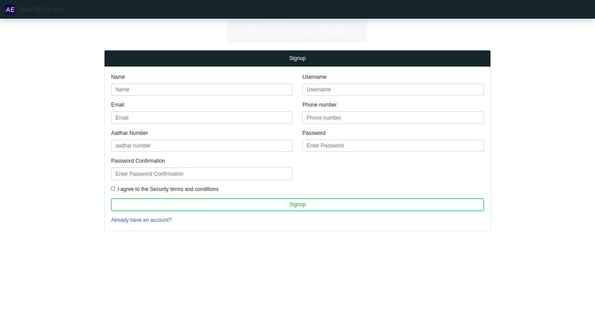

 User Login
 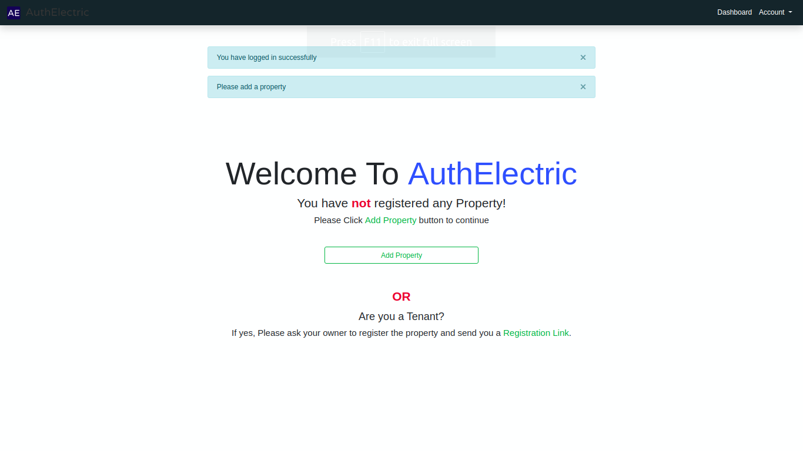

 User Dashboard
 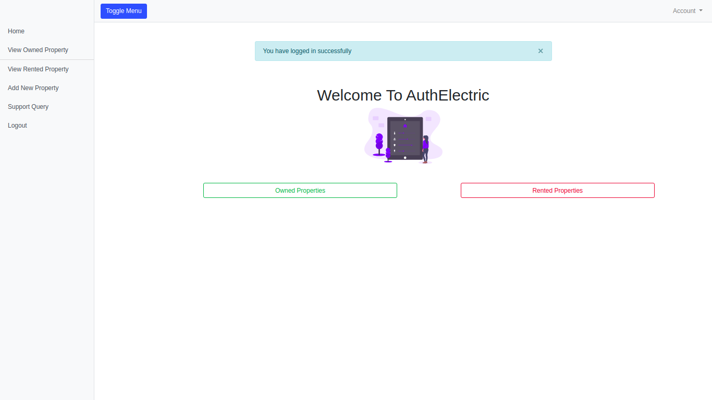

 User Add Property
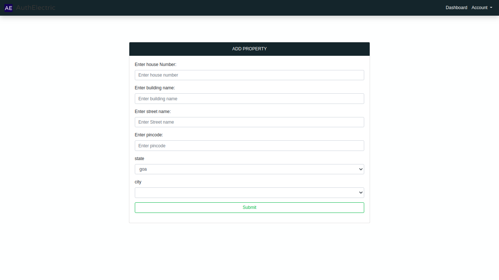

User Property Validate
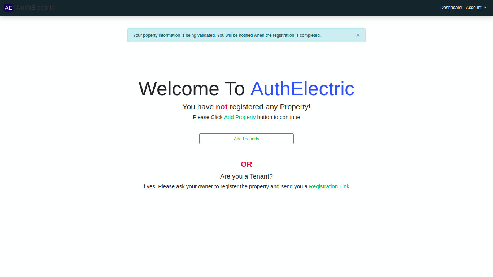

View Rented Properties 
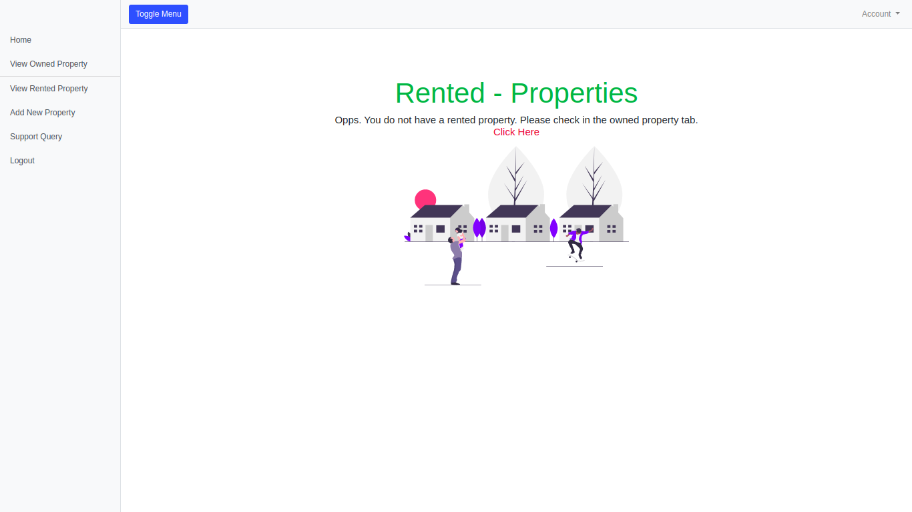

View Owned Properties
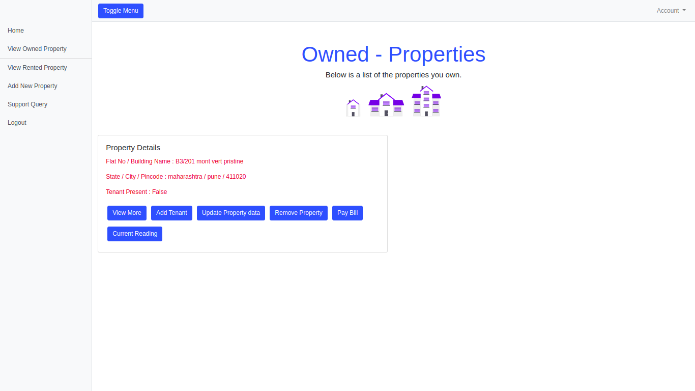

Support Query
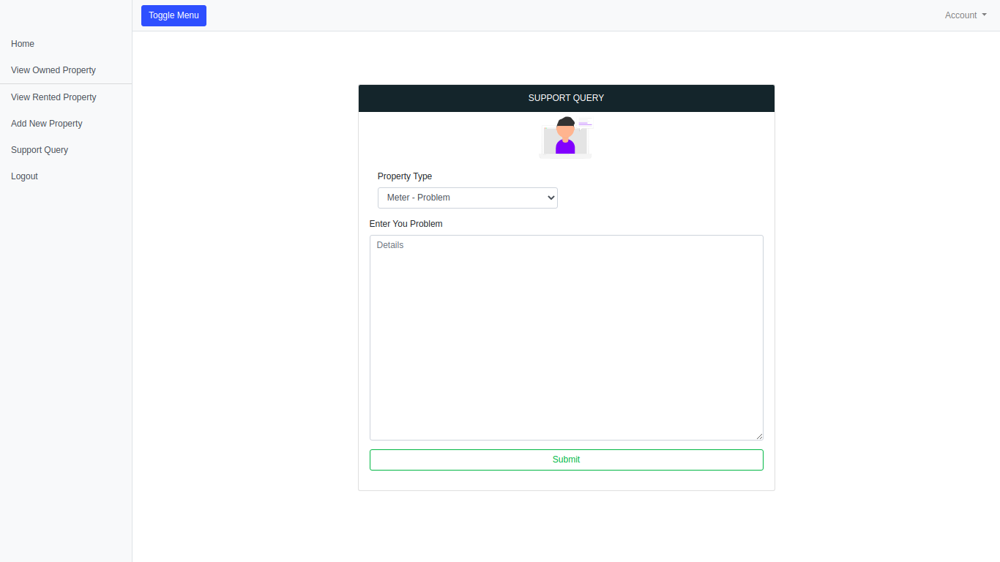

## ADMIN SIDE

Admin Login
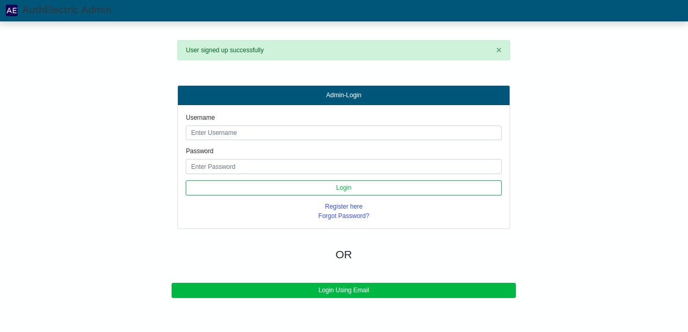

Admin Dashboard
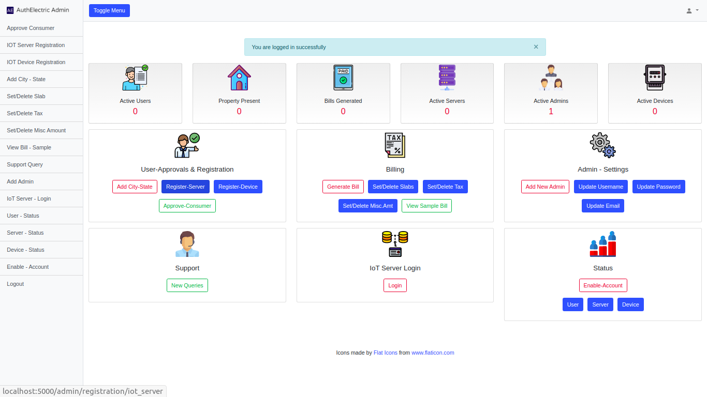

Approve User


Assign Server and Device to User
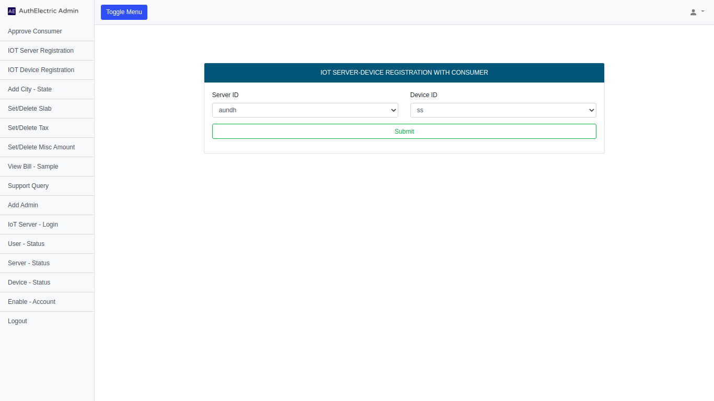


Assign Cost per Unit for Commercial as well as Residential Property
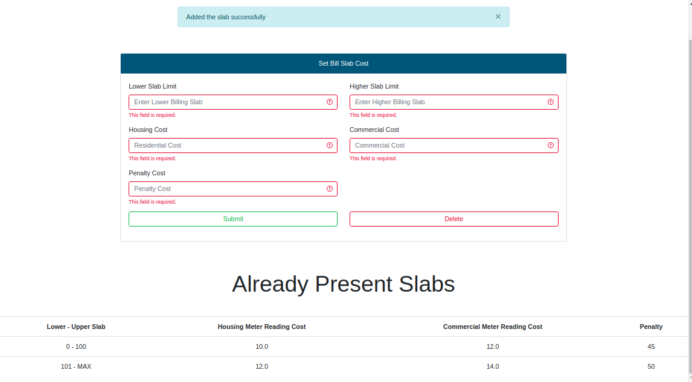

Assign Taxes
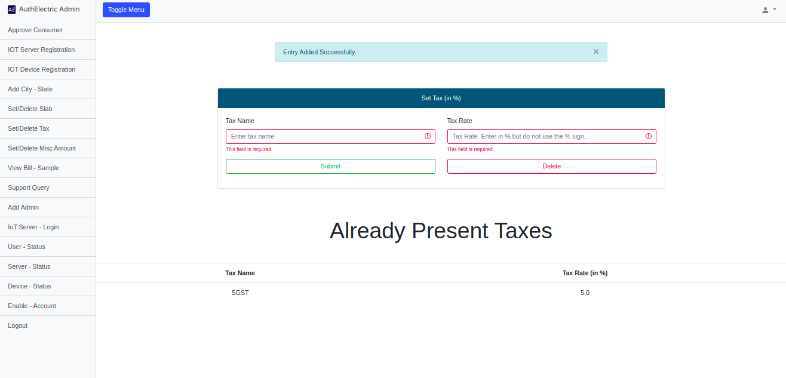

Assign Miscellaneous Costs
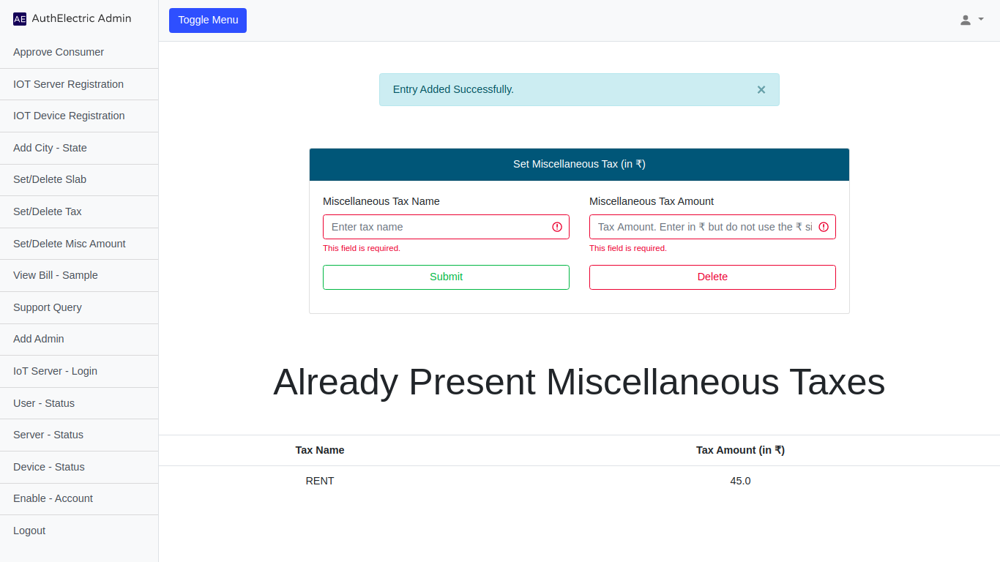

Sample Generated Bill
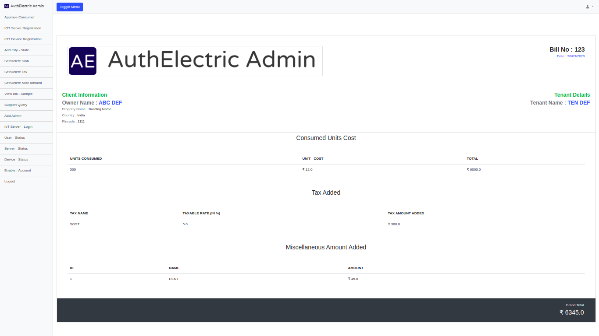


